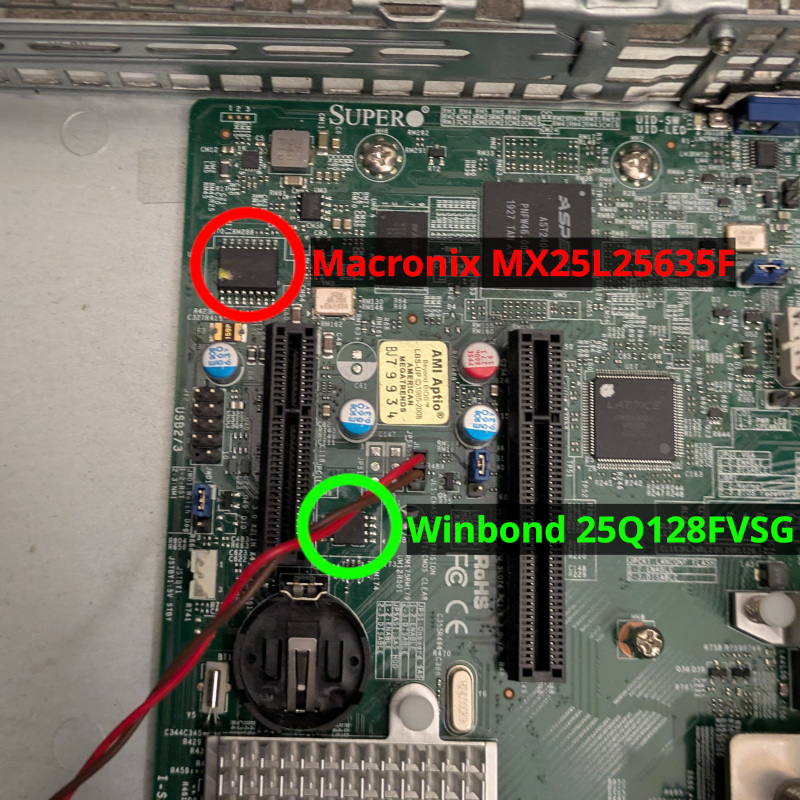
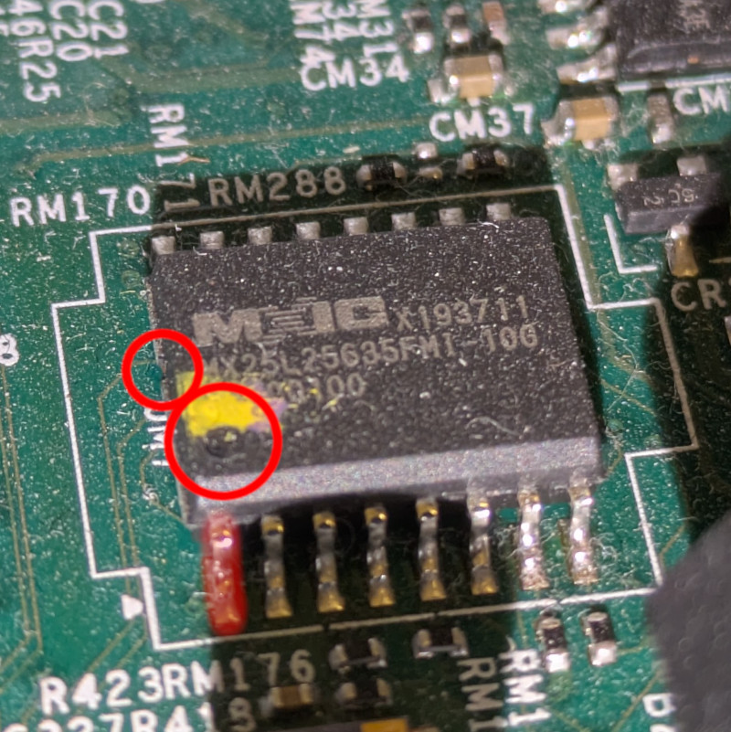
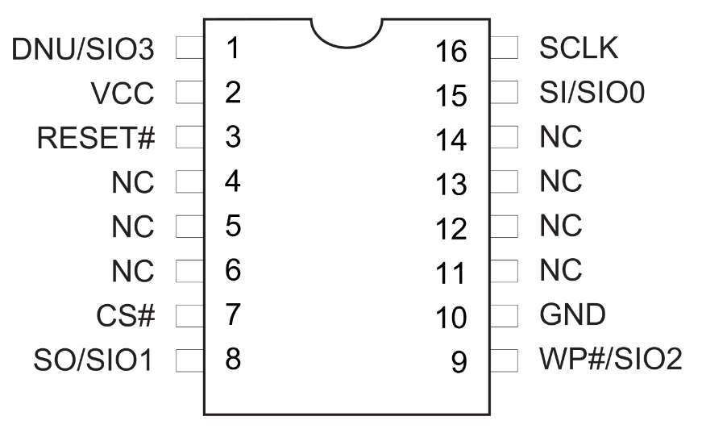

# Building OpenBMC for `x11ssh` platform.

This document will guide you through building OpenBMC for `x11ssh` platform.

## Prerequisites

### Hardware requirements

To build OpenBMC you'll need solid machine. The machine with following
configuration has been proven to be insufficient.

Partial output of `fastfetch`.
```
CPU: 12th Gen Intel(R) Core(TM) i7-1260P (16) @ 4.70 GHz
Memory: 10.16 GiB / 15.44 GiB (66%)
```

Building failed due to insufficient RAM memory available, even when no other
user processes were running.

## Building `x11ssh` configuration

### Building docker container

The image will be built inside the docker container, it should provide a
reproducible environment with all necessary tools installed.

Steps:
1. Create docker container.
    ```shell
    docker build -t ubuntu-latests-openbmc .
    ```
1. Run the container
    ```shell
    ./run.sh
    ```

### Building OpenBMC image

Perform following steps to build `openbmc` for x11ssh.

Steps:
1. Source setup file with `x11ssh` configuration.
    ```shell
    source setup x11ssh
    ```
1. Build the image (this will take a while)
    ```shell
    bitbake obmc-phosphor-image
    ```
    Generated image file should be inside following directory:
    ```shell
    ./build/x11ssh/tmp/deploy/images/x11ssh/obmc-phosphor-image-x11ssh.static.mtd
    ```

## Running the image in qemu

To test if the image works, one might run it inside `qemu`.

Steps:
1. (Optional) Copy build image to local directory.
    ```
    mkdir images
    cp ./build/x11ssh/tmp/deploy/images/x11ssh/obmc-phosphor-image-x11ssh.static.mtd images/
    ```
1. Run the built image inside qemu.
    ```
    ./runqemu.sh images/obmc-phosphor-image-x11ssh.static.mtd
    ```
    On success, you shall be greeted with login prompt.
1. Exit qemu via key combination.
    ```
    CTRL+a, x
    ```

## Flashing

This section describes recovery/flashing process.

### Chip location and details

The flash memory for BMC on `x11ssh` platform is Macronix MX25L25635F in 16-PIN
SOP package. Documentation can be found
[here](https://www.macronix.com/Lists/Datasheet/Attachments/8666/MX25L25635F,%203V,%20256Mb,%20v1.5.pdf).

The picture below shows the chip location on the `x11ssh` motherboard, marked
with a red circle.



Below is the detailed view of the chip. The circles highlight the dot and a
notch used to identify pin 1 of the chip. The pin 1 is highlighted in red.



### Connecting RTE

The image can be flashed using
[RTE](https://shop.3mdeb.com/shop/open-source-hardware/rte/?srsltid=AfmBOoqP5uST8J6MRdp41I-dletjgiEX6e77Oa18S1fsuCWHbAFzD_jI).
Below is the pinout of the chip.



_Source_:
[Macronix](https://www.macronix.com/Lists/Datasheet/Attachments/8666/MX25L25635F,%203V,%20256Mb,%20v1.5.pdf)

The chip needs to be connected to the SPI header on RTE. The pinout for the
the header is as follows.
```text
             ______
         >  |      |
Vcc 3.3V  ----1  2----  GND
            |      |
    MOSI  ----3  4----  CS
            |      |
    MISO  ----5  6----  CLK
            |______|
```

Here's a table of connections

| RTE PIN | FLASH MEM. PIN |
|---------|----------------|
| 1       | 2              |
| 2       | 10             |
| 3       | 15             |
| 4       | 7              |
| 5       | 8              |
| 6       | 16             |


### Flashing the image

1. Verify the flash is properly detected.

```bash
 flashrom -p linux_spi:dev=/dev/spidev1.0,spispeed=1000
```

1. (If necessary) Backup the image. A good practice is to perform this at least
3 times and verify if checksums are matching.

```bash
flashrom -p linux_spi:dev=/dev/spidev1.0,spispeed=1000 -r #image_name#
```

1. Flash the image

```bash
flashrom -p linux_spi:dev=/dev/spidev1.0,spispeed=1000 -w obmc-phosphor-image-x11ssh.static.mtd
```

Result

```text
flashrom v1.3.0 on Linux 5.4.69 (armv7l)
flashrom is free software, get the source code at https://flashrom.org

Using clock_gettime for delay loops (clk_id: 1, resolution: 1ns).
Found Macronix flash chip "MX25L25635F/MX25L25645G" (32768 kB, SPI) on linux_spi.
===
This flash part has status UNTESTED for operations: WP
The test status of this chip may have been updated in the latest development
version of flashrom. If you are running the latest development version,
please email a report to flashrom@flashrom.org if any of the above operations
work correctly for you with this flash chip. Please include the flashrom log
file for all operations you tested (see the man page for details), and mention
which mainboard or programmer you tested in the subject line.
Thanks for your help!
Reading old flash chip contents... done.
Erasing and writing flash chip... Erase/write done.
Verifying flash... VERIFIED.

```
